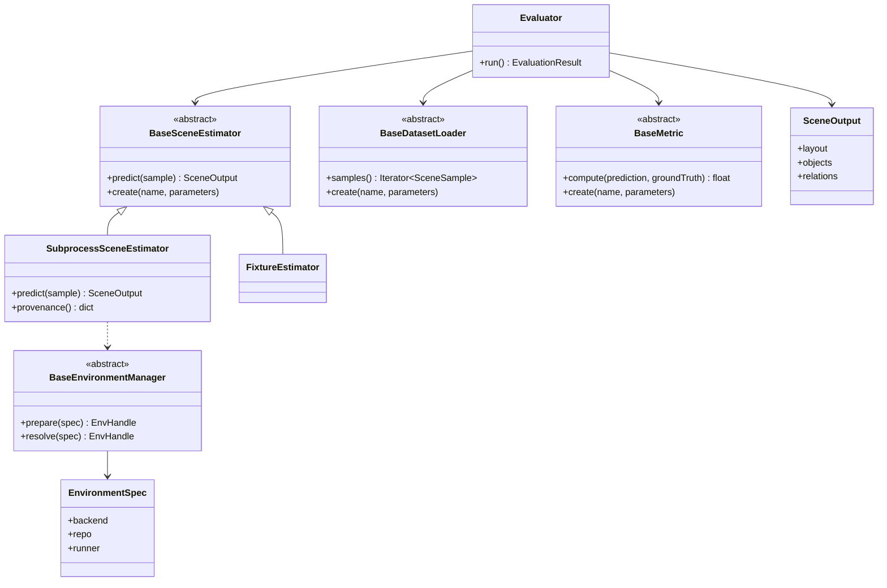
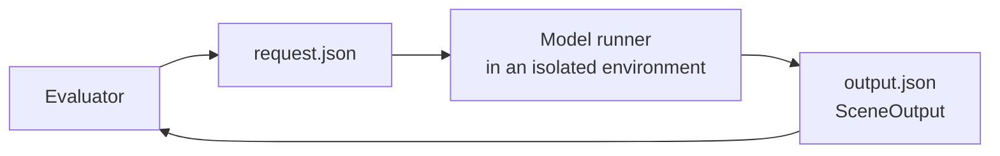

# Benchmark toolbox architecture

How the toolbox is put together: what the components are, what contracts hold between
them, and where a new method plugs in. What each metric means is in
[metrics.md](metrics.md); how to run things is in [usage.md](usage.md).

The design follows from one requirement: several methods, each needing an incompatible
software stack, must be scored by identical code and leave enough of a trace to be
re-run later.

## Components



Extension points use an "abstract class + registry" approach: implementations register
via a decorator, which replaces `if/elif` chains, and package imports replace manual
`sys.path` edits. Several config names may point at one implementation through
`registry.alias` (`dpc`/`holopano` → `SubprocessSceneEstimator`, `igibson` →
`ManifestDatasetLoader`): the configs stay readable without an empty subclass per name,
since what a run actually executes is fixed by the environment spec and its runner. The estimator, dataset loader, metric, and environment manager are all
built this way.

## Model isolation

Different models require incompatible stacks (DeepPanoContext runs on Python 3.7 with
torch 1.7.1+cu110, while the toolbox core runs on Python 3.9). Importing such stacks into
one process is impossible, so the model is never imported into the toolbox process: the
estimator launches a separate process in an isolated environment and exchanges JSON files
with it.



The exchange contract: the process receives paths via the `{request}` and `{output}`
substitutions, exits with code 0, and writes a valid `SceneOutput`. stdout/stderr logs
are kept if the process fails.

Entering that environment is the expensive part — for DPC, deserializing the first
prediction imports the gibson2 stack at ~36 s, against under a millisecond for every
further one in the same process. A runner may therefore declare `runner.batch: true` and
receive all samples in one launch, which is what makes the isolated path usable for a
whole test set (500 scenes in about a minute instead of hours) without weakening the
isolation. The full contract is in [runners/README.md](../runners/README.md).

## Environment manager

The run environment depends on the model. An environment is described by a declarative
`EnvironmentSpec` (`configs/environments/*.yaml`), and `BaseEnvironmentManager` builds and
resolves it with a set of backends:

| Backend | Purpose |
|---|---|
| `conda` | the main one — DPC family (old PyTorch/CUDA, binary deps) |
| `venv` | lightweight models and local development |

The manager implements two methods:

- `prepare(spec)` — an idempotent build: clone the repo, apply patches (unpin hard pins
  in the env file, `git apply`), create the environment, install dependencies, download
  weights with a sha256 check. Completion is recorded by a marker with the spec
  fingerprint; calling it again does not rebuild. On network-restricted hosts, weights are
  taken from a pre-staged local directory (`BENCHMARK_TOOLBOX_ARTIFACTS`).
- `resolve(spec)` — produces an `EnvHandle`: a command prefix (e.g.
  `conda run -n <env> python`), a working directory, and environment variables.

A model config references an environment spec; the `{request}`/`{output}` substitutions
are appended to the command automatically:

```yaml
model:
  type: dpc
  parameters:
    environment: ../environments/dpc.yaml
```

An explicit command (`command:` — an argument array with the same substitutions) is also
supported. `benchmark-toolbox env doctor` reports the available backends and GPU.

## Runners

A runner (`runners/<model>_runner.py`) executes inside the model environment: it reads
`{request}`, runs inference, converts the native result to `SceneOutput`, and writes
`{output}`. A runner uses the standard library only and does not import the toolbox
package, since it runs in a foreign environment.

Converters map different representations to a single `SceneOutput`. Objects carry an
ORIENTED 3D box (`center`/`size`/`basis`) so a rotated 3D-IoU can be computed; the layout
is reduced to axis-aligned from its eight corners. The DPC result (`data.pkl`) is
converted by `dpc_runner.convert_data_pkl`; the same converter serves all three paper
methods (DPC, Im3D-Pano, Total3D-Pano), since they are configurations of one
DeepPanoContext code base and produce the same `data.pkl`.

## Execution and running on a cluster

The toolbox runs locally on the machine it is invoked on and makes no remote connections.
To run on a compute cluster, place the repository on it; `benchmark-toolbox env
submit-script` produces a batch script (SLURM or bash) that runs `env prepare` and `run`
on the node. Submitting the job to the scheduler is up to the user.

## Experiment flow

1. (once per model) `env prepare` builds the isolated environment.
2. The CLI reads the experiment config and fixes the random seed.
3. Factories create the estimator, dataset loader, and metrics.
4. The dataset loader yields `SceneSample`s.
5. The estimator runs the runner in the model environment and returns a normalized
   `SceneOutput`.
6. Metrics are computed by one code path.
7. Values are aggregated as mean, median, and a 95% confidence interval.
8. `summary.json`, `report.md`, and `run.json` (config, git revision, and environment
   info: backend, fingerprint, commit) are written.
